# 🏜️ Oasis.nvim

A modular desert-themed colorscheme for Neovim with warm, earthy tones and multiple palette variants (12 Total Themes). Originally inspired by the classic `desert` theme for vim, also uses the cool/warm philosophy from `melange` (i.e., `warm colors = action/flow` and `cool colors = structure/data`).

> [!TIP]
> Use TMUX? There is a companion TMUX plugin for this **Oasis** theme suite: [tmux-oasis](https://github.com/uhs-robert/tmux-oasis)

## Features

- **12 theme variants**: Covers the entire rainbow of options with an emphasis on being dark. Variants are all desert-inspired.
- **Comprehensive highlighting** - LSP, Tree-sitter, and plugin support
- **Fast loading** - Direct highlight application for optimal performance
- **Zero dependencies** - Works out of the box without external plugins
- **Modular architecture** - Easy to customize and extend

## Theme Overview

Choose from 12 distinct desert-inspired variants, each with its own personality and color palette:

> Click one below to see a larger image along with code syntax preview

<table>
  <tr>
    <td align="center">
      <a href="#lagoon---blue"></a><br>
      <strong>Lagoon</strong><br><em>Blue</em>
    </td>
    <td align="center">
      <a href="#dune---yellow"></a><br>
      <strong>Dune</strong><br><em>Yellow</em>
    </td>
    <td align="center">
      <a href="#night---off-black"></a><br>
      <strong>Night</strong><br><em>Off Black</em>
    </td>
    <td align="center">
      <a href="#desert---grey"></a><br>
      <strong>Desert</strong><br><em>Grey</em>
    </td>
  </tr>
  <tr>
    <td align="center">
      <a href="#sol---red"></a><br>
      <strong>Sol</strong><br><em>Red</em>
    </td>
    <td align="center">
      <a href="#twilight---purple"></a><br>
      <strong>Twilight</strong><br><em>Purple</em>
    </td>
    <td align="center">
      <a href="#abyss---black"></a><br>
      <strong>Abyss</strong><br><em>Black</em>
    </td>
    <td align="center">
      <a href="#mirage---teal"></a><br>
      <strong>Mirage</strong><br><em>Teal</em>
    </td>
  </tr>
  <tr>
    <td align="center">
      <a href="#canyon---orange"></a><br>
      <strong>Canyon</strong><br><em>Orange</em>
    </td>
    <td align="center">
      <a href="#rose---pink"></a><br>
      <strong>Rose</strong><br><em>Pink</em>
    </td>
    <td align="center">
      <a href="#starlight---black-vivid"></a><br>
      <strong>Starlight</strong><br><em>Black Vivid</em>
    </td>
    <td align="center">
      <a href="#cactus---green"></a><br>
      <strong>Cactus</strong><br><em>Green</em>
    </td>
  </tr>
</table>

**[↓ See all variants expanded with code syntax](#view-all-theme-variants)**

## Installation

### Using lazy.nvim

```lua
{
  "uhs-robert/oasis.nvim",
  config = function()
    vim.cmd.colorscheme("oasis") -- or use a variant like ("oasis_desert")
  end
}
```

### Using packer.nvim

```lua
use {
  "uhs-robert/oasis.nvim",
  config = function()
    vim.cmd.colorscheme("oasis")-- or use a variant like ("oasis_desert")
  end
}
```

### Manual Installation

```bash
git clone https://github.com/uhs-robert/oasis.nvim ~/.config/nvim/pack/plugins/start/oasis.nvim
```

## Usage

### Basic Usage

```lua
-- Use default theme (lagoon variant)
vim.cmd.colorscheme("oasis")

-- Or set colorscheme directly with a specific palette
vim.cmd.colorscheme("oasis_desert")

-- Or use the Lua API directly
require('oasis').apply('oasis_desert')
```

### Commands

```vim
:Oasis oasis_desert    " Switch to another palette (i.e., oasis_desert, oasis_lagoon, oasis_starlight etc:)
:OasisExport list      " List available palettes
```

## Architecture

The colorscheme uses a modular architecture with:

- **Direct highlight application** - Uses `vim.api.nvim_set_hl()` for optimal performance
- **Palette-based system** - Colors organized by semantic meaning (warm/cool/neutral)
- **Zero external dependencies** - Self-contained implementation

## View All Theme Variants

<details open>
  <summary><b>All variants (click to collapse)</b></summary>

### Sol - Red

Hot, scorching desert sun with intense red tones


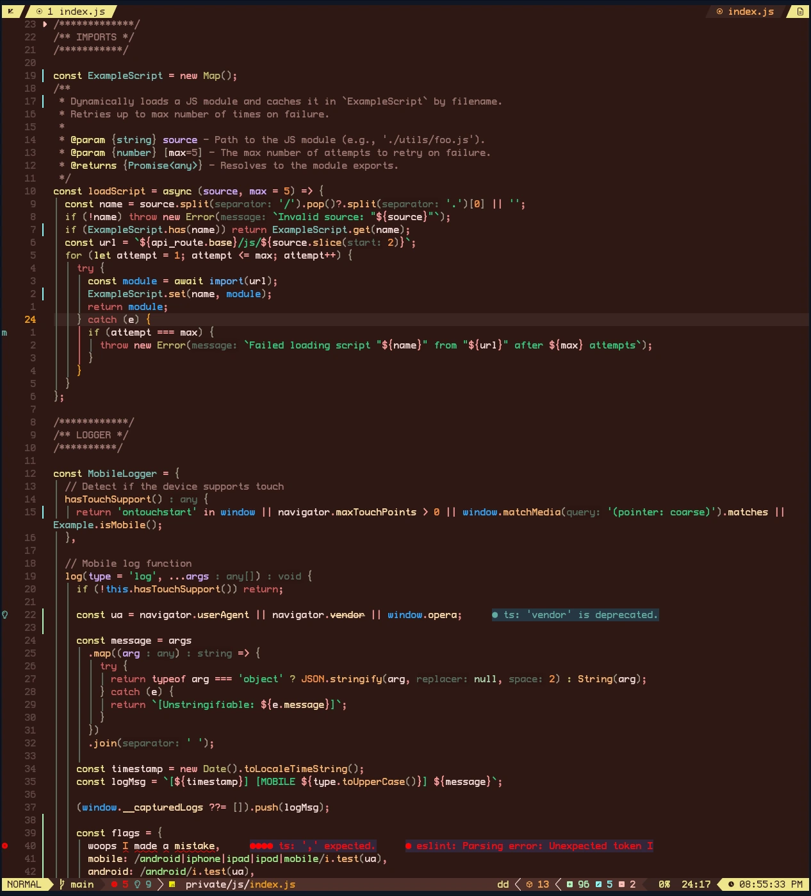

### Canyon - Orange

Rich oranges of desert canyon walls


### Dune - Yellow

Sandy beiges and warm yellow earth tones


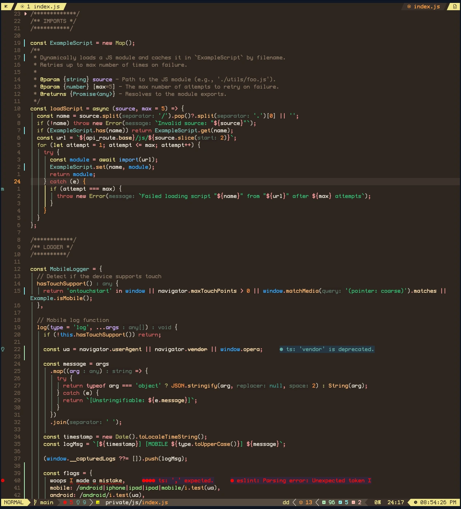

### Cactus - Green

Fresh greens of desert vegetation


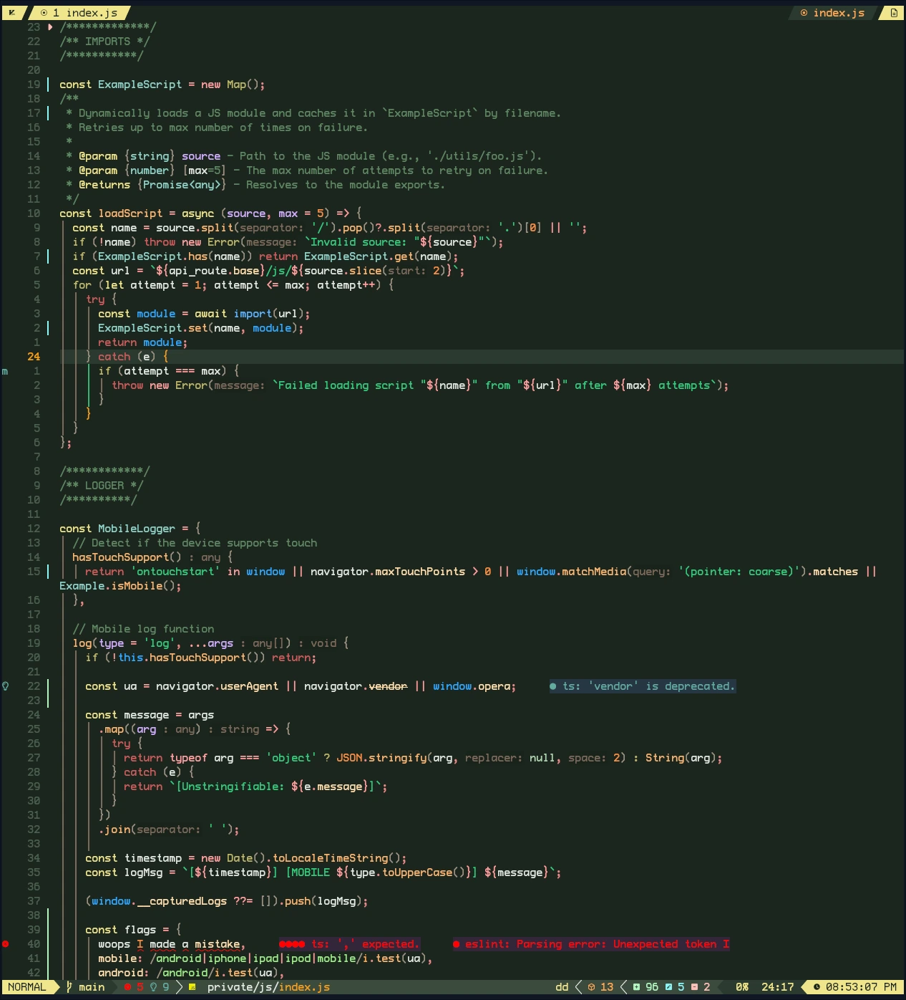

### Mirage - Teal

Cool teals of shimmering desert mirages


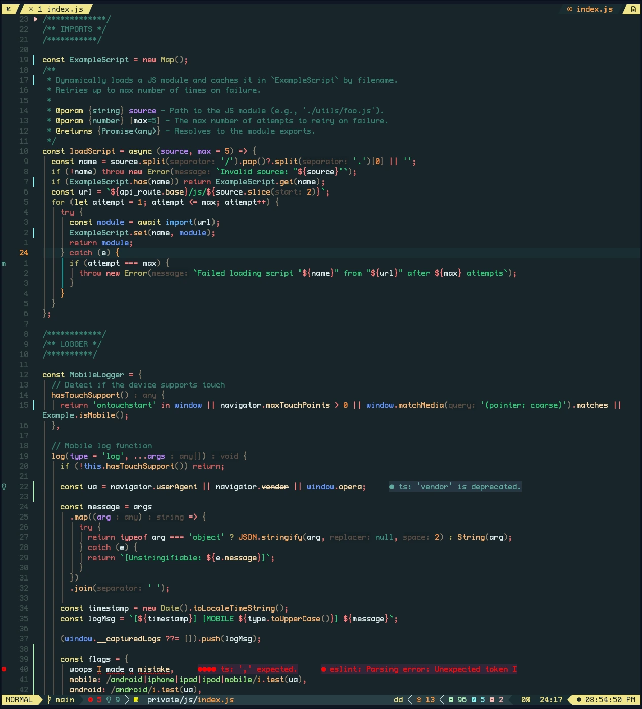

### Lagoon - Blue

The original Oasis theme and default variant, featuring cool blues of the oasis lagoon


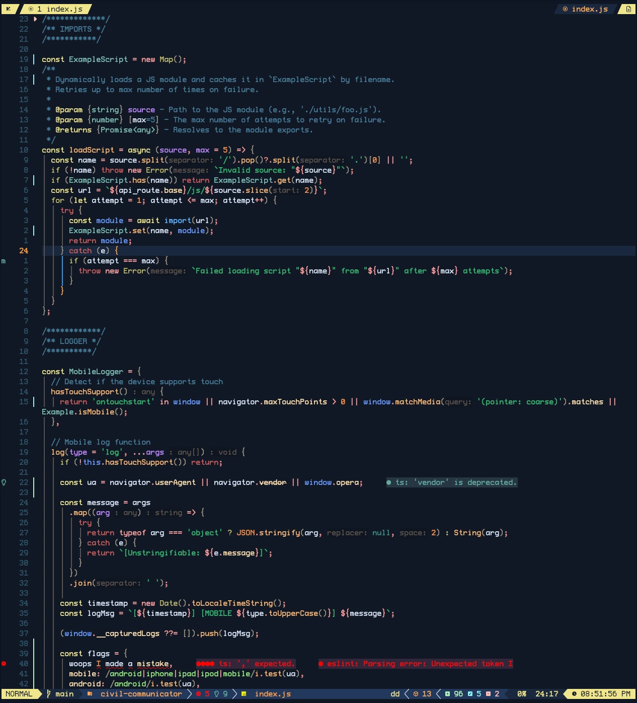

### Rose - Pink

Soft pinks of the warm desert rose


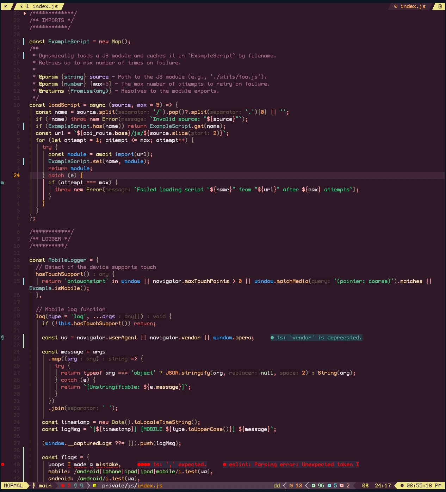

### Twilight - Purple

Evening desert with purple and indigo hues


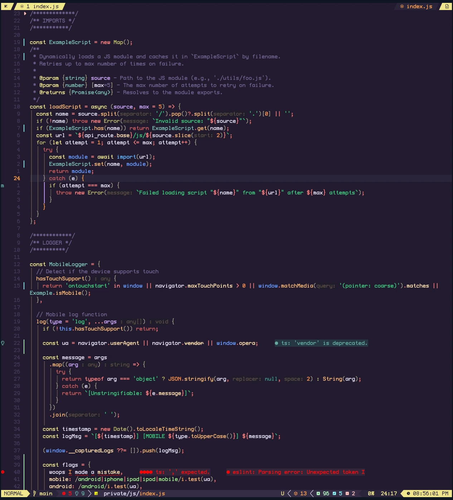

### Desert - Grey

Inspired by the classic vim desert theme, neutral sand and earth tones


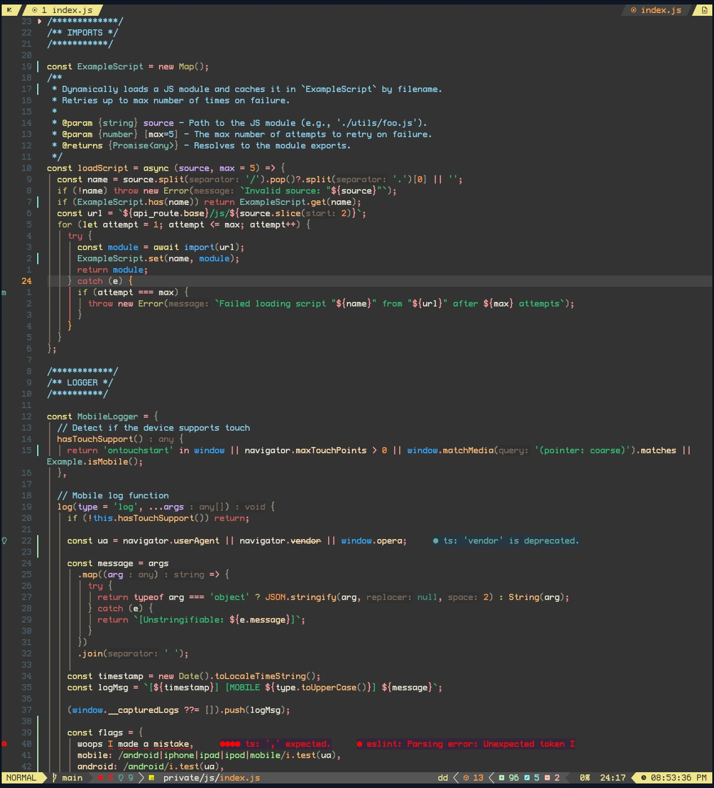

### Night - Off Black

Deep desert night sky, almost black for those who prefer softer darkness


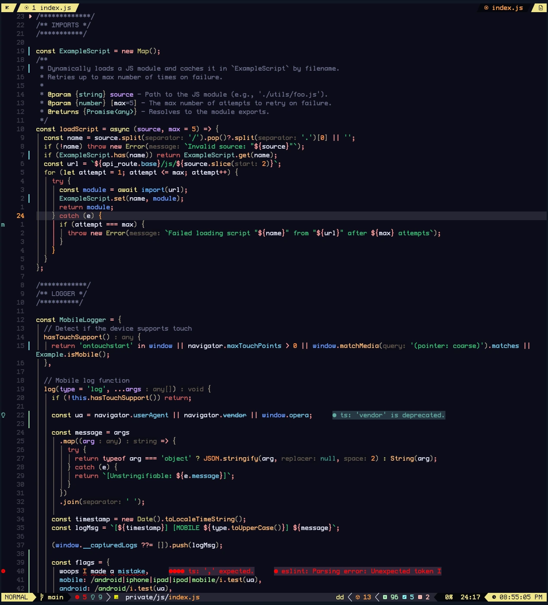

### Abyss - Black

Deep, dark variant with mysterious depths


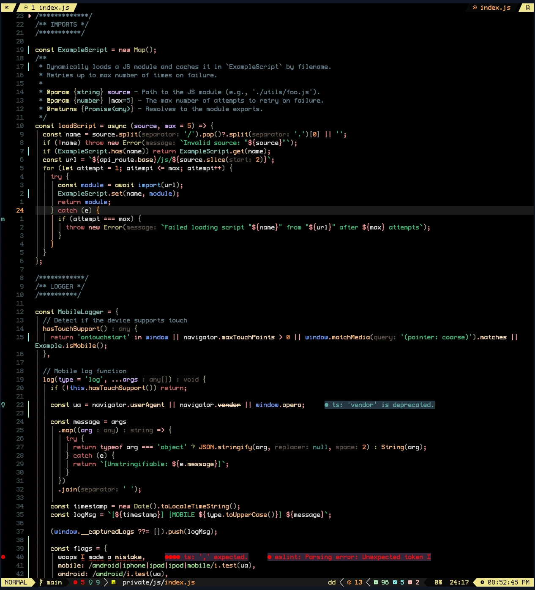

### Starlight - Black Vivid

Desert abyss illuminated by brilliant starlight with vivid accent colors


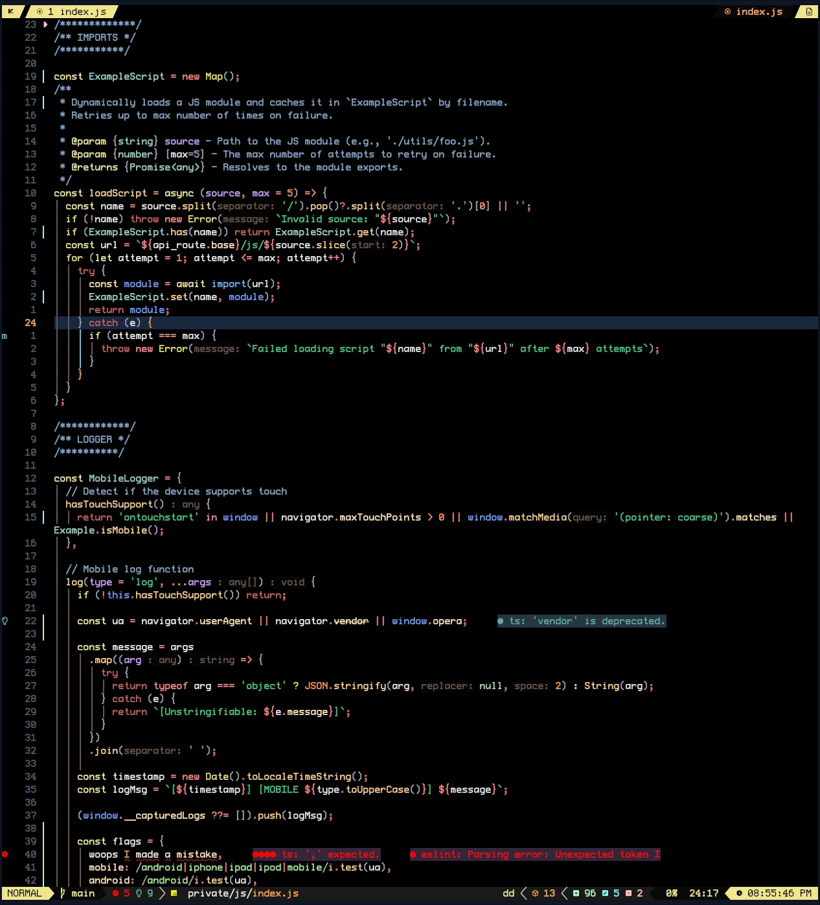

</details>
