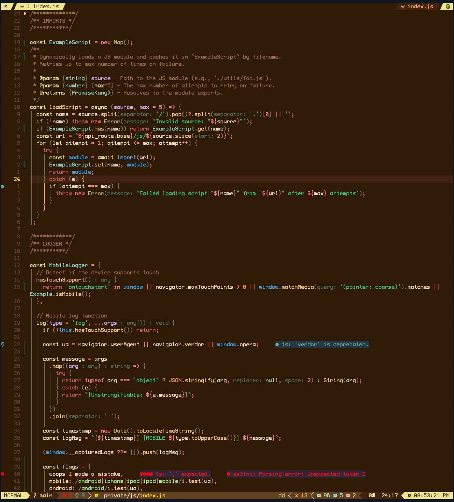

# 🏜️ Oasis.nvim

A modular desert-themed colorscheme for Neovim with warm, earthy tones and multiple palette variants (12 Total Themes). Originally inspired by the classic `desert` theme for vim, also uses the cool/warm philosophy from `melange` (i.e., `warm colors = action/flow` and `cool colors = structure/data`).

> [!NOTE]
> Use TMUX? There is a companion TMUX plugin for this **Oasis** theme suite: [tmux-oasis](https://github.com/uhs-robert/tmux-oasis)

## ✨ Features

- **12 theme variants**: Covers the entire rainbow of options with an emphasis on being dark. Variants are all desert-inspired.
- **Comprehensive highlighting** - LSP, Tree-sitter, and plugin support
- **Fast loading** - Direct highlight application for optimal performance
- **Zero dependencies** - Works out of the box without external plugins
- **Modular architecture** - Easy to customize and extend

<details>
<summary>🎨 Supported Plugins</summary>

<!-- plugins:start -->

| Plugin                                                      |
| ----------------------------------------------------------- |
| [fzf-lua](https://github.com/ibhagwan/fzf-lua)              |
| [gitsigns.nvim](https://github.com/lewis6991/gitsigns.nvim) |
| [snacks.nvim](https://github.com/folke/snacks.nvim)         |
| [which-key.nvim](https://github.com/folke/which-key.nvim)   |

<!-- plugins:end -->
</details>

<details>
<summary>🍭 Extras</summary>

<!-- extras:start -->

| Tool  | Extra                                                  |
| ----- | ------------------------------------------------------ |
| Kitty | [extras/kitty](extras/kitty)                           |
| TMUX  | [tmux-oasis](https://github.com/uhs-robert/tmux-oasis) |

<!-- extras:end -->
</details>

## 🌅 Overview

Choose from 12 distinct desert-inspired variants, each with its own personality and color palette:

> [!TIP]
> Click one below to see a larger image along with code syntax preview
>
> **[Vote for your favorite variant →](https://github.com/uhs-robert/oasis.nvim/discussions/2)**

<table>
  <tr>
    <td align="center">
      <a href="#night---off-black"></a><br>
      <strong>Night</strong><br><em>Off Black</em>
    </td>
    <td align="center">
      <a href="#abyss---black"></a><br>
      <strong>Abyss</strong><br><em>Black</em>
    </td>
    <td align="center">
      <a href="#starlight---black-vivid"></a><br>
      <strong>Starlight</strong><br><em>Black Vivid</em>
    </td>
    <td align="center">
      <a href="#desert---grey"></a><br>
      <strong>Desert</strong><br><em>Grey</em>
    </td>
  </tr>
  <tr>
    <td align="center">
      <a href="#sol---red"></a><br>
      <strong>Sol</strong><br><em>Red</em>
    </td>
    <td align="center">
      <a href="#canyon---orange"></a><br>
      <strong>Canyon</strong><br><em>Orange</em>
    </td>
    <td align="center">
      <a href="#dune---yellow"></a><br>
      <strong>Dune</strong><br><em>Yellow</em>
    </td>
    <td align="center">
      <a href="#cactus---green"></a><br>
      <strong>Cactus</strong><br><em>Green</em>
    </td>
  </tr>
  <tr>
    <td align="center">
      <a href="#mirage---teal"></a><br>
      <strong>Mirage</strong><br><em>Teal</em>
    </td>
    <td align="center">
      <a href="#lagoon---blue"></a><br>
      <strong>Lagoon (Default)</strong><br><em>Blue</em>
    </td>
    <td align="center">
      <a href="#twilight---purple"></a><br>
      <strong>Twilight</strong><br><em>Purple</em>
    </td>
    <td align="center">
      <a href="#rose---pink"></a><br>
      <strong>Rose</strong><br><em>Pink</em>
    </td>
  </tr>
</table>

**[↓ 👀 View all variants expanded with code syntax](#view-all-theme-variants)**

## 📦 Installation

Install the theme with your preferred package manager, such as
[folke/lazy.nvim](https://github.com/folke/lazy.nvim):

```lua
{
  "uhs-robert/oasis.nvim",
  config = function()
    vim.cmd.colorscheme("oasis") -- or use a variant like ("oasis_desert")
  end
}
```

## 🚀 Usage

```lua
-- Use default theme (lagoon variant)
vim.cmd.colorscheme("oasis")
```

```vim
colorscheme oasis

" You may also use different variants
colorscheme oasis-abyss
colorscheme oasis-cactus
colorscheme oasis-canyon
colorscheme oasis-desert
colorscheme oasis-dune
colorscheme oasis-lagoon
colorscheme oasis-mirage
colorscheme oasis-night
colorscheme oasis-rose
colorscheme oasis-sol
colorscheme oasis-starlight
colorscheme oasis-twilight
```

Some plugins need extra configuration to work with **Oasis**.

<details>
  <summary>Click here for more details</summary>

### Lualine

Oasis includes automatic Lualine theme integration that matches your current palette:

```lua
require('lualine').setup {
  options = {
    theme = 'oasis'  -- Automatically matches your current Oasis palette
  }
}
```

### Tabby (Tab Bar)

For enhanced tab bar styling that matches your Oasis theme:

```lua
require('tabby').setup({
  theme = 'oasis'  -- Uses current Oasis palette for tab styling
})
```

</details>

## 🍭 Extras

Extra color configs for [Kitty](https://sw.kovidgoyal.net/kitty/conf.html) can be found in [extras](extras/). If you'd like an extra config added, raise a feature request and I'll put it together.

To use the extras, refer to their respective documentation.

There are also companion plugins for other applications:

- **TMUX**: [tmux-oasis](https://github.com/uhs-robert/tmux-oasis)

## 🎯 Vote for Your Favorite Variant

Want to help shape **Oasis.nvim**?
**[👉 Join the Discussion and Vote Here](https://github.com/uhs-robert/oasis.nvim/discussions/2)**

> [!IMPORTANT]
> Click the screenshot of your favorite variant in the discussion and hit 👍 on the comment.
>
> You can vote for more than one and leave feedback about contrast, accents, or plugin integration.

<a id="view-all-theme-variants"></a>

## 👀 View All Theme Variants

<details open>
  <summary><b>All variants (click to collapse)</b></summary>

### Night - Off Black

Deep desert night sky, almost black for those who prefer softer darkness


### Abyss - Black

Deep, dark variant with mysterious depths


### Starlight - Black Vivid

Desert abyss illuminated by brilliant starlight with vivid accent colors


### Desert - Grey

Inspired by the classic vim desert theme, neutral sand and earth tones


### Sol - Red

Hot, scorching desert sun with intense red tones


### Canyon - Orange

Rich oranges of desert canyon walls




### Dune - Yellow

Sandy beiges and warm yellow earth tones


### Cactus - Green

Fresh greens of desert vegetation


### Mirage - Teal

Cool teals of shimmering desert mirages


### Lagoon - Blue

The original Oasis theme and default variant, featuring cool blues of the oasis lagoon


### Twilight - Purple

Evening desert with purple and indigo hues


### Rose - Pink

Soft pinks of the warm desert rose


</details>
